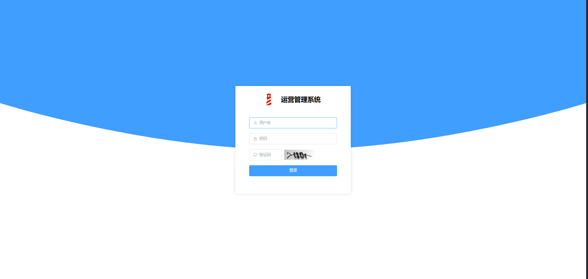
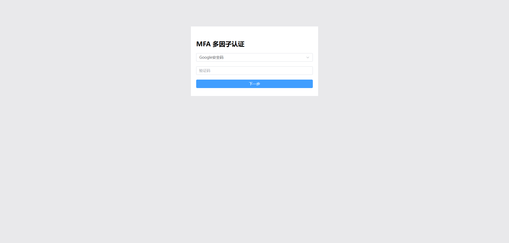
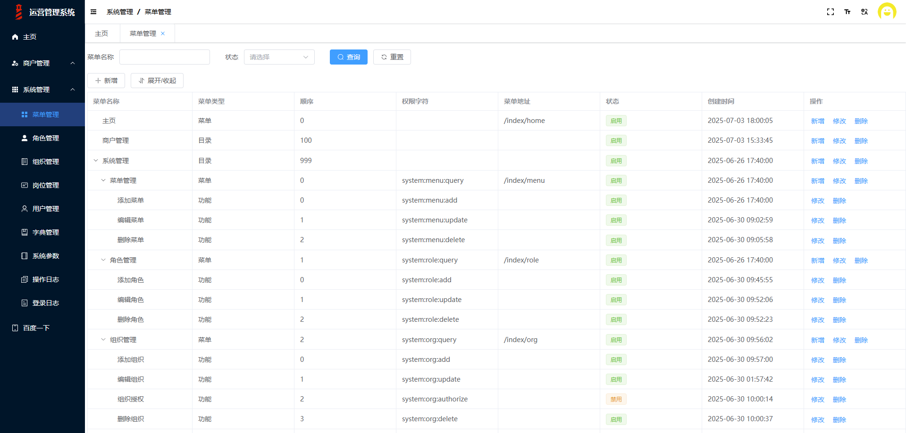
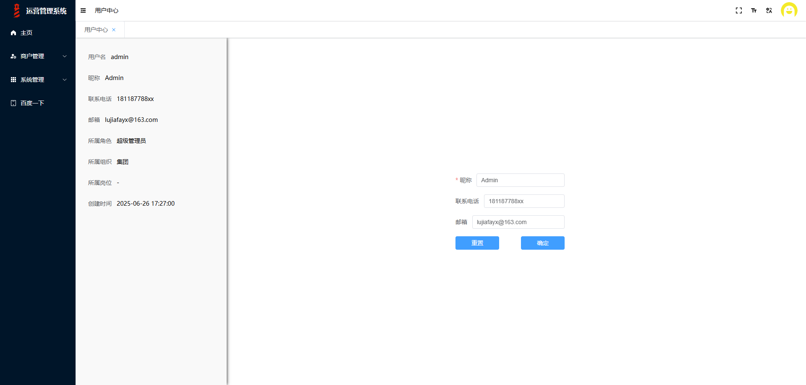

<div align="center">

# Houtu Admin (后土管理平台)

**基于 Houtu 框架的企业级权限管理系统**

[](https://opensource.org/licenses/MIT)
[](https://openjdk.org/)
[](https://spring.io/projects/spring-boot)
[](https://vuejs.org/)
[](https://element-plus.org/)

前后端分离的权限管理系统，实现菜单、角色、用户、岗位、组织等一体化权限控制，满足企业级管理平台需求。

[功能特性](#-功能特性) | [界面预览](#-界面预览) | [技术架构](#-技术架构) | [快速开始](#-快速开始) | [项目结构](#-项目结构) | [参与贡献](#-参与贡献)

</div>

---

## 界面预览

### 登录页


### MFA 双因素认证


### 主页面


### 个人中心


---

## 功能特性

### 权限管理
- **用户管理** — 用户增删改查、状态管理、密码重置
- **角色管理** — 角色分配、菜单权限绑定、数据权限控制
- **菜单管理** — 多级菜单配置、按钮级权限控制、动态路由
- **组织管理** — 树形组织架构、部门层级管理
- **岗位管理** — 岗位编码与名称维护、用户岗位分配

### 系统管理
- **字典管理** — 系统字典类型与数据维护，支持状态控制
- **参数管理** — 系统参数配置、动态修改
- **公告管理** — 系统公告发布与查看

### 安全 & 审计
- **登录认证** — 基于 Spring Security，支持图形验证码（Kaptcha）
- **MFA 双因素认证** — 集成 Google Authenticator（OTP），通过 `spring.security.mfa=true` 开启（默认关闭），开启后登录需二次验证，支持扫码绑定
- **登录日志** — 记录登录时间、IP、状态等信息
- **操作日志** — 关键操作审计追踪

### 体验增强
- **多布局模式** — 支持正常模式、全屏模式、移动端模式，适配不同使用场景
- **国际化 (i18n)** — 中英文双语切换，基于 Vue I18n
- **字号切换** — 支持大、中、小三档字号，适应不同用户视觉偏好
- **Swagger 文档** — 基于 SpringDoc OpenAPI，接口文档自动生成

---

## 技术架构

```
┌──────────────────────── 前端 (mp-web) ────────────────────────┐
│  Vue 3 + Element Plus + Pinia + Vue Router + Vue I18n + Vite  │
└───────────────────────────────┬────────────────────────────────┘
                                │ RESTful API
┌───────────────────────────────┼──── 后端 (mp) ────────────────────────────┐
│                               │                                           │
│  ┌─── 安全层 ─────────┐  ┌─── 数据层 ─────────┐  ┌─── 基础设施 ──────┐  │
│  │ Spring Security    │  │ MyBatis Plus      │  │ Redis (缓存/会话) │  │
│  │ Session (Redis)    │  │ MySQL             │  │ Caffeine (L2缓存) │  │
│  │ Kaptcha 验证码     │  │ HikariCP 连接池    │  │ Log4j2 日志       │  │
│  │ Google Auth (MFA)  │  └────────────────────┘  └───────────────────┘  │
│  └────────────────────┘                                                  │
│                                                                          │
│  ┌─── Houtu 框架 ────────────────────────────────────────────────────┐   │
│  │ houtu-web (统一参数解析/响应封装/异常处理)                          │   │
│  │ houtu-web-swagger (SpringDoc OpenAPI 文档增强)                     │   │
│  └───────────────────────────────────────────────────────────────────┘   │
└──────────────────────────────────────────────────────────────────────────┘
```

### 前端技术栈

| 技术 | 说明 |
|------|------|
| Vue 3 | 渐进式 JavaScript 框架 |
| Element Plus | Vue 3 UI 组件库 |
| Pinia | Vue 状态管理 |
| Vue Router | 前端路由 |
| Vue I18n | 国际化 |
| Vite 5 | 下一代前端构建工具 |
| Axios | HTTP 客户端 |
| Iconify | 图标解决方案 |

### 后端技术栈

| 技术 | 说明 |
|------|------|
| JDK 8 | Java 运行环境 |
| Spring Boot 2.7.x | 应用框架 |
| Spring Security | 安全框架 |
| Spring Session | 分布式会话管理 |
| MyBatis Plus | ORM 增强框架 |
| Redis + Lettuce | 缓存 & 会话存储 |
| MySQL | 关系型数据库 |
| [Houtu](https://github.com/lujiafa/houtu-dependencies) | 企业级 Java 基础框架 |

---

## 快速开始

### 环境要求

| 环境 | 版本 |
|------|------|
| JDK | 8+ |
| Maven | 3.6+ |
| Node.js | 18+ |
| MySQL | 5.7+ / 8.0+ |
| Redis | 5.0+ |

### 1. 克隆项目

```bash
git clone -b 2.7.0 https://github.com/lujiafa/houtu-admin.git
cd houtu-admin
```

### 2. 初始化数据库

创建 MySQL 数据库并导入初始化脚本：

```bash
mysql -u root -p < docs/sql/base.sql
```

### 3. 启动后端

```bash
cd mp

# 修改数据库和 Redis 连接配置
# 编辑 src/main/resources/application-dev.yml

# 启动
mvn spring-boot:run
```

后端服务默认启动在 `http://localhost:9090`。

### 4. 启动前端

```bash
cd mp-web

npm install

npm run serve:dev
```

前端服务默认启动在 `http://localhost:81`。

---

## 项目结构

```
houtu-admin
├── mp/                          # 后端 (Spring Boot)
│   └── src/main/java/
│       └── com/xx/mp/
│           ├── aspect/          # AOP 切面
│           ├── config/          # 配置类
│           │   └── security/    # Spring Security 配置
│           ├── module/
│           │   ├── base/        # 基础模块 (登录/菜单/用户中心/MFA)
│           │   └── sys/         # 系统管理模块
│           │       ├── controller/  # 接口层
│           │       ├── dao/         # 数据访问层
│           │       ├── entity/      # 实体类
│           │       ├── service/     # 业务逻辑层
│           │       └── vo/          # 视图对象
│           ├── support/         # 通用支撑
│           └── util/            # 工具类
├── mp-web/                      # 前端 (Vue 3)
│   └── src/
│       ├── components/          # 公共组件
│       ├── layout/              # 布局组件
│       ├── locale/              # 国际化资源
│       ├── router/              # 路由配置
│       ├── store/               # Pinia 状态管理
│       ├── utils/               # 工具函数
│       └── views/               # 页面视图
│           ├── UserManage/      # 用户管理
│           ├── RoleManage/      # 角色管理
│           ├── MenuManage/      # 菜单管理
│           ├── OrgManage/       # 组织管理
│           ├── PostManage/      # 岗位管理
│           ├── DictManage/      # 字典管理
│           ├── ParamsManage/    # 参数管理
│           ├── Announcement/    # 公告管理
│           ├── LoginLog/        # 登录日志
│           ├── OptLog/          # 操作日志
│           └── ...
└── docs/
    └── sql/                     # 数据库脚本
        └── base.sql
```

---

## 关联项目

| 项目 | 说明 |
|------|------|
| [houtu-dependencies](https://github.com/lujiafa/houtu-dependencies) | Houtu 基础框架 — 提供 Web 增强、缓存、安全、Spring Cloud 扩展等企业级基础设施 |

---

## 参与贡献

欢迎各种形式的贡献：

- **报告问题** — 使用 [Issues](https://github.com/lujiafa/houtu-admin/issues) 提交 Bug 或功能建议
- **提交代码** — Fork 仓库 → 创建功能分支 → 提交 Pull Request
- **完善文档** — 修正错误、补充示例、改进说明
- **测试反馈** — 在不同环境下测试并反馈兼容性

---

## 许可证

MIT License
